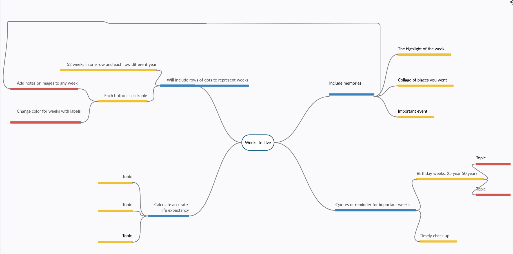

# WeeksToLive
An application that shows your life expectancy by the weeks where you can include memories.

### Goals for the App
* To let people check and value how short their life is.
* Visualize how far they have come and how much they still have left to work harder.
* Store important notes and memories for each week to look back later in life.
* Stay focused and motivated in tasks realizing how fast weeks 

### Target Audience?
* Mostly youngsters getting started in their adult life, useful for keeping yourself in check.
* Parents saving memories for their kids.
* Entrepreneurs storing 

### Brainstormed Ideas for the app
